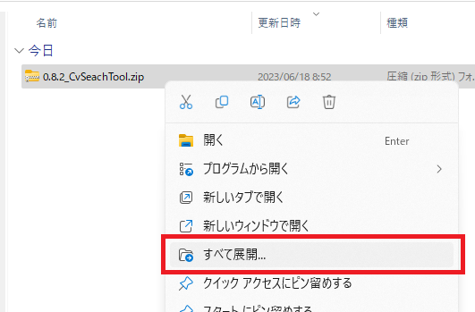
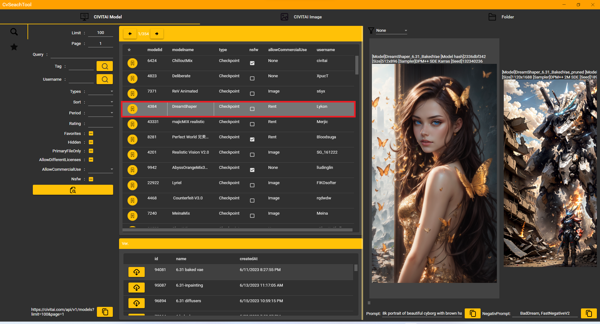

# Chovitai

[CIVITAI](https://civitai.com/)の検索を効率化することを目的としたツールです。
CIVITAIを調べていると同じところをぐるぐる回ってしまうので作りました。

例えば以下のことができます。

- Checkpointを人気順に表示する
- LoRAを人気順に表示する
- 投稿画像を反応順に表示する
- AUTOMATIC1111/stable-diffusion-webuiで過去に生成した画像のPromptを確認する

など

Civitai上にはNSFWな画像も多く存在するため年齢制限X指定のツールです。
ご使用の際は十分にご注意ください。

画面イメージ

<!--more-->

## インストール手順

### ダウンロード

以下の場所からzipファイルをダウンロードします。
(最新のバージョンのものを取得してください)

https://github.com/zeikomi552/CvSeachTool/releases

### インストール

ダウンロードしたzipファイルを展開します。

展開後の様子。

フォルダの中に入っていきます。

setup.exeを実行します。
(.NET6が必要なためインストーラーでエラーが出た場合は.NET6のインストールが必要です。)

以下の表示が出た人は詳細情報を開きます。

実行

次へ

次へ

次へ

はい

閉じる

## 基本的な使い方

### 起動
少し気持ち悪いセンスのアイコンがデスクトップに登場します。
（やっつけでつくったので、その内変えます。たぶん。）
ダブルクリック！！

### モデル検索

何の説明もない愛想のない画面が登場します。
まずは検索ボタンを押してみます。

そこそこ(数秒)検索に時間がかかります。

CIVITAIを触る人にはなじみのある画像が出てきます。

選択を切り替えていくことで画像イメージが切り替わります。

検索条件はこの辺りをいじってみてください。

ランキング順に検索するには以下のようにすればできます。

### ブックマーク

☆マークを押すとブックマーク画面に移動します。

先ほどのモデル検索の画面のこいつです。

チェックマークにすると以下のように保存されていきます。

アイコンと操作感がいまいちなのでその内変更すると思います。

### イメージ検索

CIVITAI Imageのタブをクリックします。
画面全体が切り替わります。

検索ボタンをクリックします。

画像データを取得してきます。

検索条件はこの辺りを適当に弄ってみてください。

## 過去につくった画像のプロンプト確認

Folderのタブをクリックします。

フォルダのアイコンをクリックします。

AUTOMATIC1111/stable-diffusion-webuiで生成した画像が保管されているフォルダを選択します。

画像が読み込まれます。

画像上に埋め込まれている生成した時点の情報が表示されます。

変なアイコンをクリックするとクリップボードにコピーされます。

メモ帳等に貼り付けが可能です。

## フィルター

ここと

ここに

フィルターがあります。

Noneが一番健全でXがこの世の性癖すべてを見させられます。
一番上の空白はフィルタ無しなのでXと同じ扱いです。
また、NoneでフィルタしていてもCIVITAI側が自動判定しているからか結構X指定が出てきます。
ご使用の際はお気をつけください。

## 余談

アプリ名を変更しました。
CvSeachTool → Chovitai
ずっとスペルミスをしてた。
